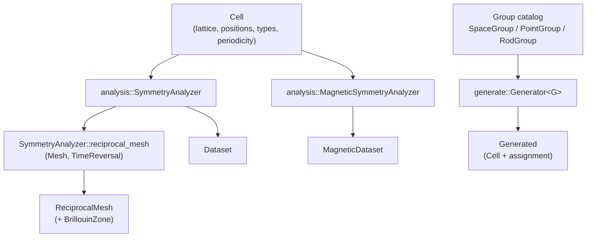
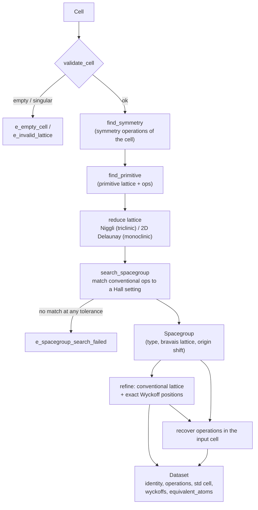
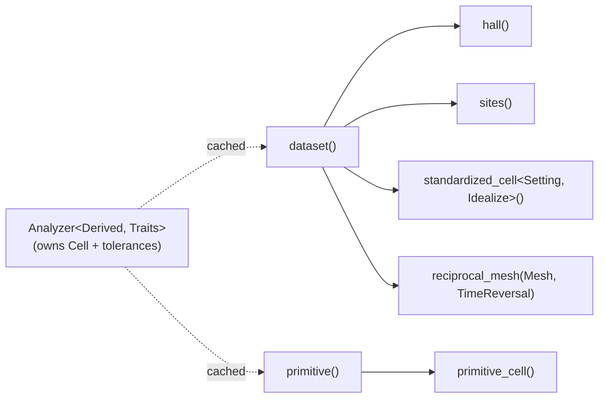
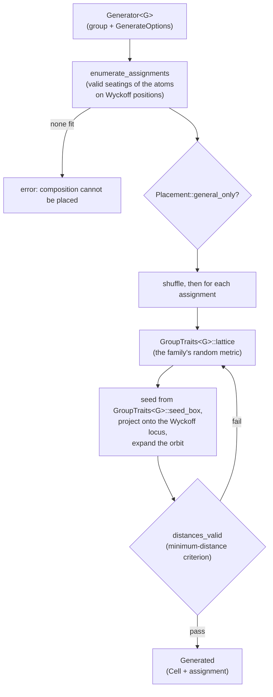
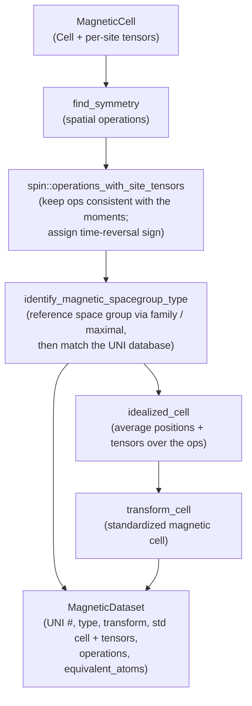
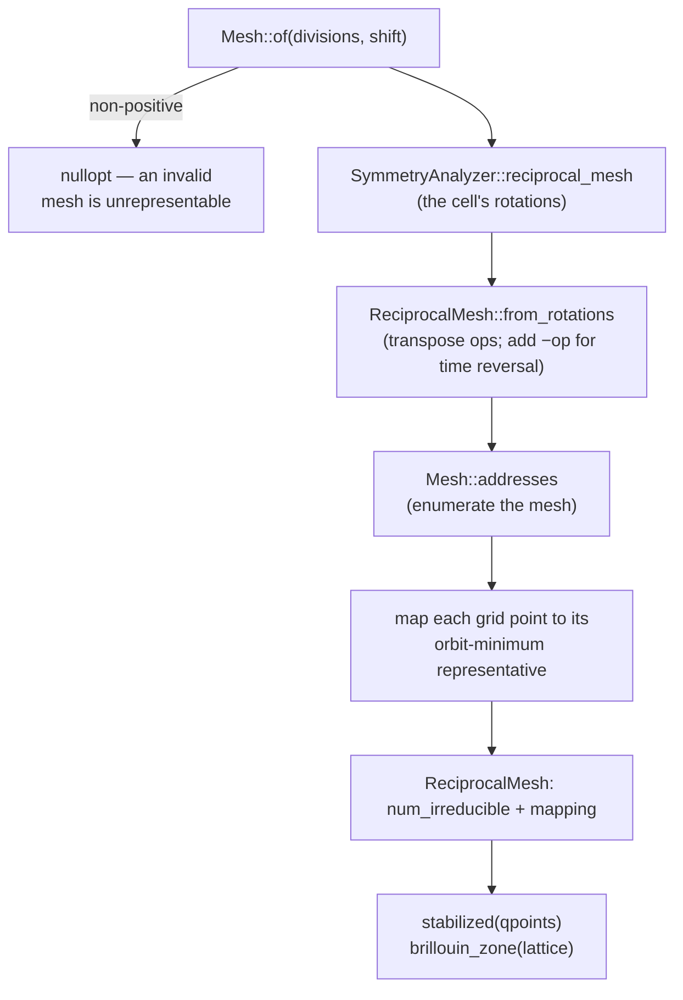
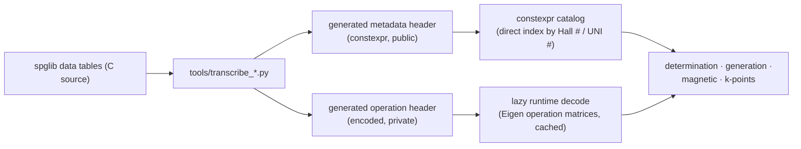

# Workflow

How data flows through CppCrystal's pipelines. Each diagram is a Mermaid
flowchart; GitHub renders them inline. Boxes name the module or function that
does the work.

## Top-level pipelines

## Space-group determination — `SymmetryAnalyzer`

The core pipeline. A cell goes in; a fully classified, standardized dataset
comes out.

The Wyckoff data comes from the site-symmetry database keyed by the matched Hall
key; the standardized cell is the idealized conventional setting, and the
recovered operations are expressed back in the original input basis.

A layer cell — one whose periodicity has an aperiodic axis — runs the same
pipeline, instantiated with `GroupFamily::layer` instead of `GroupFamily::space`.
The family is a compile-time template parameter, so every stage's family
difference is an `if constexpr`, not a runtime test on a Hall number's sign;
`dispatch_family()` at the top is the single runtime branch.

### The analyzer facade

`SymmetryAnalyzer` wraps this pipeline and memoizes it. Each public getter is a
projection of one cached dataset (or of an independently cached intermediate):

`SymmetryAnalyzer` and `MagneticSymmetryAnalyzer` are the two `Derived` types:
the memo, the projections and the `const &`-qualified accessors live once in
`Analyzer`, and each `Traits` supplies the cell type, the dataset type and the
one pipeline call that fills it. The projections return references into the memo,
so the rvalue overloads are deleted — the analyzer must outlive what it hands
back.

## Structure generation — `Generator<G>`

Generation is the determination pipeline run in reverse: pick a group, seat a
composition on its Wyckoff sites, and materialize coordinates.

One generator covers every family. `GroupTraits<G>` answers the only four
questions that differ — what to call the family in an error, how its cell is
periodic, where in that cell a seed coordinate belongs, and the random metric one
attempt is drawn in — and a layer group is not a separate specialisation but a
`SpaceGroup` whose Hall key names the layer family. Because the cell carries its
own periodicity, the orbit expansion and the distance check need no family branch
at all: a cluster is a cell with no periodic axis, and the same
`distances_valid(Cell)` is its all-pairs Euclidean check.

## Magnetic analysis — `MagneticSymmetryAnalyzer`

## Reciprocal-space reduction — `kpoint::ReciprocalMesh`

The irreducible representative is taken as the orbit minimum directly: the
reciprocal group is closed, so one pass over the rotations reaches every point in
an orbit, giving a canonical mapping independent of iteration order. `Mesh` is
constexpr throughout — its index/address round trip is `static_assert`ed in the
header rather than tested at runtime — and it carries its own shift, so the
`(mesh, is_shift)` pair no longer travels separately.

## Where the symmetry data comes from

Every pipeline above reads from compiled-in catalogs rather than parsing files
at runtime.

Metadata (numbers, symbols, centering, multiplicities) is decoded once at
compile time and indexed directly by the group's key. Operation matrices, which
cannot be `constexpr` because they are `Eigen` types, are decoded on first use
and cached. `cppcrystal::warmup()` builds every Hall setting of both families up
front — about 30 ms — so the caches are race-free for concurrent reads and the
cost is off the query path.
