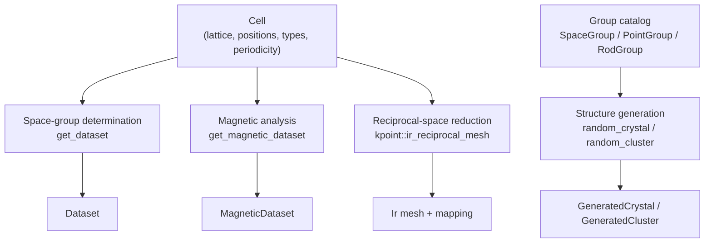
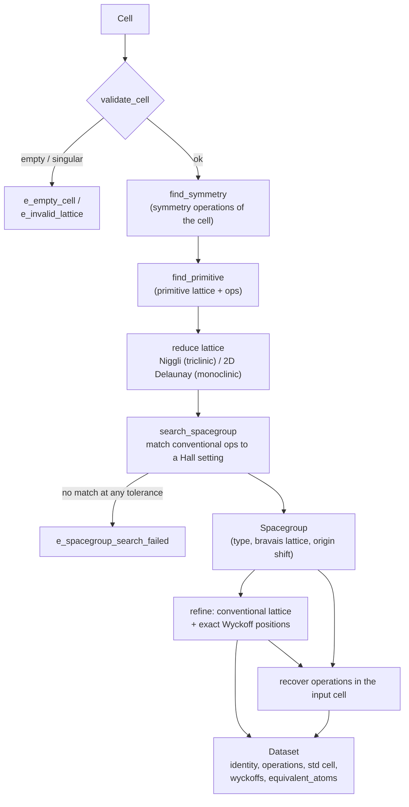
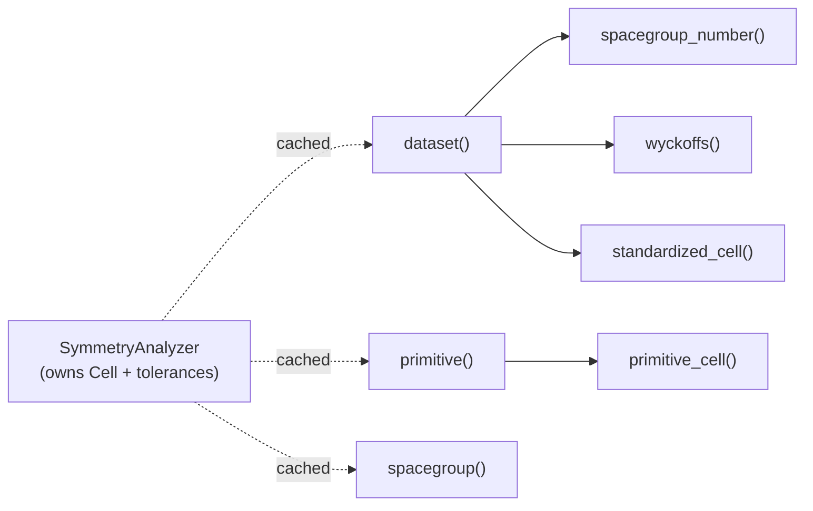
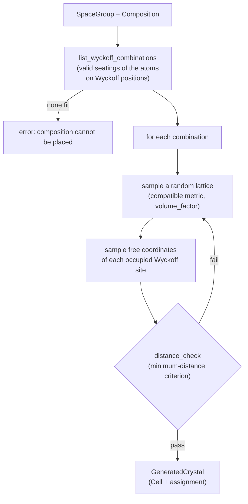
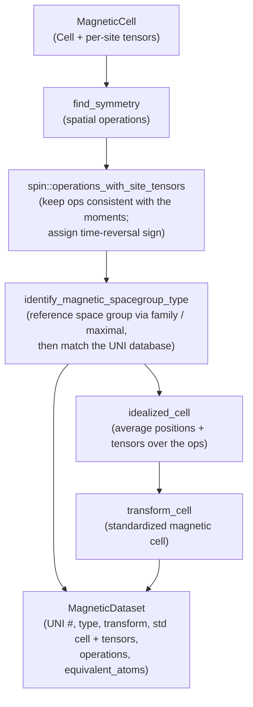
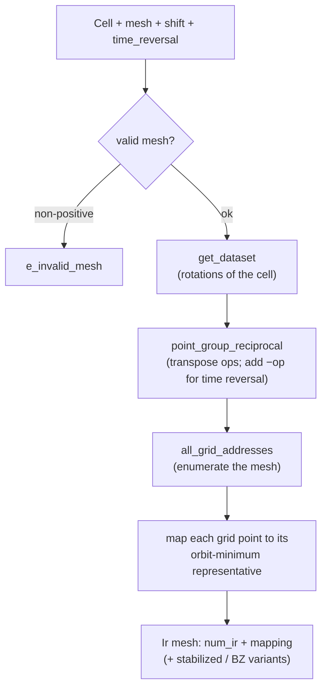
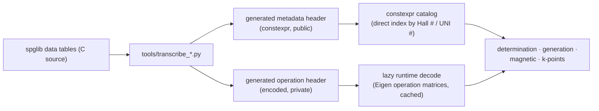

# Workflow

How data flows through CppCrystal's pipelines. Each diagram is a Mermaid
flowchart; GitHub renders them inline. Boxes name the module or function that
does the work.

## Top-level pipelines

## Space-group determination — `get_dataset`

The core pipeline. A cell goes in; a fully classified, standardized dataset
comes out.

The Wyckoff data comes from the site-symmetry database keyed by the matched Hall
number; the standardized cell is the idealized conventional setting, and the
recovered operations are expressed back in the original input basis.

`get_layer_dataset` runs the same pipeline with one aperiodic axis set on the
cell; matching then draws from the layer-group settings (negative Hall numbers).

### The analyzer facade

`SymmetryAnalyzer` wraps this pipeline and memoizes it. Each public getter is a
projection of one cached dataset (or of an independently cached intermediate):

## Structure generation — `random_crystal`

Generation is the determination pipeline run in reverse: pick a group, seat a
composition on its Wyckoff sites, and materialize coordinates.

`random_layer_crystal` and the rod-group overload share this loop with 2D/1D
lattices; `random_cluster` replaces the lattice with a point-group metric and
runs an all-pairs (non-periodic) distance check.

## Magnetic analysis — `get_magnetic_dataset`

## Reciprocal-space reduction — `kpoint::ir_reciprocal_mesh`

The irreducible representative is taken as the orbit minimum directly: the
reciprocal group is closed, so one pass over the rotations reaches every point in
an orbit, giving a canonical mapping independent of iteration order.

## Where the symmetry data comes from

Every pipeline above reads from compiled-in catalogs rather than parsing files
at runtime.

Metadata (numbers, symbols, centering, multiplicities) is decoded once at
compile time and indexed directly by the group's key. Operation matrices, which
cannot be `constexpr` because they are `Eigen` types, are decoded on first use
and cached. `spglib::warmup()` primes these caches up front so they are race-free
for concurrent reads.
